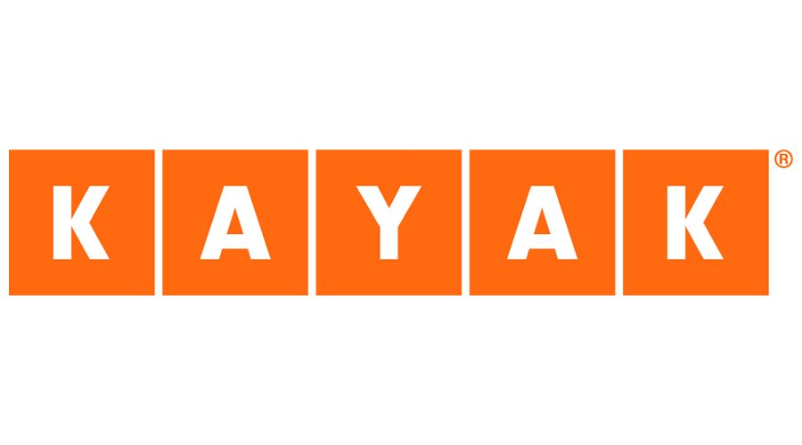

# Bloc 1 - Data Collection & Management

# Projet KAYAK

## À propos de Kayak

Kayak est un moteur de recherche de voyages qui aide les utilisateurs et utilisatrices à préparer leur prochain séjour au meilleur prix, en comparant notamment les offres de transports, d'hébergements et de locations.

Ce dépôt correspond au **bloc 1** du parcours Data Science full stack : collecte et gestion des données pour alimenter des recommandations (destinations et hôtels en France).

## 1. Objectif du projet

Construire une base de données exploitable par KAYAK pour recommander :

- les meilleures destinations de vacances en France ;
- les meilleurs hôtels dans ces destinations.

Les recommandations s'appuient sur des données réelles :

- géolocalisation des villes ;
- météo prévisionnelle ;
- données d'hôtels issues de Booking.

## 2. Livrables attendus

- Un fichier CSV enrichi dans S3 contenant les données villes + météo + hôtels.
- Une base SQL sur AWS RDS contenant les mêmes données nettoyées que S3.
- Deux cartes :
  - Top 5 destinations (score météo) ;
  - Top 20 hôtels.

## 3. Périmètre fonctionnel (features)

- Sélection d'un scope de villes françaises.
- Géocodage (latitude / longitude) des villes.
- Extraction météo sur 7 jours et calcul d'un score météo.
- Classement des destinations par attractivité météo.
- Scraping des hôtels Booking pour les meilleures destinations.
- Enrichissement et nettoyage des données hôtels.
- Génération de cartes PNG pour la visualisation.
- Envoi des CSV vers AWS S3.
- ETL depuis S3 vers une base PostgreSQL AWS RDS.

## 4. Architecture du pipeline

1. **Notebook 01** : scope + géocodage des villes  
2. **Notebook 02** : météo 7 jours + scoring + carte Top 5  
3. **Notebook 03** : scraping Booking + enrichissement + carte Top 20  
4. **Notebook 04** : envoi des CSV vers AWS S3  
5. **Notebook 05** : ETL S3 → PostgreSQL AWS RDS

## 5. Stack technique et choix

### Python et notebooks

- **Jupyter Notebook** : adapté à un workflow data itératif, pédagogique et facilement démontrable.
- **Pandas / NumPy** : manipulation tabulaire, nettoyage, calculs de score.

### Gestion d'environnement

- **uv** : installation rapide et verrouillage des dépendances (`uv.lock`).

### Collecte de données

- **Requests** : appels API (OpenWeatherMap, géocodage selon le notebook).
- **Playwright** : scraping Booking avec rendu JavaScript et meilleure robustesse qu'un simple parseur HTML.

### Visualisation

- **Plotly** : cartes interactives et export PNG via Kaleido.
- **Kaleido** : rendu statique des figures Plotly.

### Cloud et stockage

- **AWS S3** : stockage central des artefacts CSV.
- **AWS RDS PostgreSQL** : entrepôt SQL cible pour l'équipe d'analyse.

### Connexion / ETL

- **boto3** : accès AWS (S3).
- **SQLAlchemy + psycopg2-binary** : chargement des DataFrames vers PostgreSQL.
- **python-dotenv** : gestion des secrets via variables d'environnement.

## 6. Structure du projet

- `images/kayak-logo.png` : logo Kayak (README)
- `pyproject.toml` / `uv.lock` : dépendances Python gérées par **uv**
- `notebooks/01_scope_geocoding_nominatim.ipynb`
- `notebooks/02_weather_scoring_top5_map.ipynb`
- `notebooks/03_booking_scraping_playwright.ipynb`
- `notebooks/04_send_csv_to_aws_s3.ipynb`
- `notebooks/05_etl_s3_to_rds_postgres.ipynb`
- `outputs/data/` : CSV intermédiaires et enrichis
- `outputs/maps/` : cartes exportées en PNG
- `outputs/logs/` : journaux d'upload et d'ETL
- `.env.dist` : modèle des variables d'environnement

## 7. Prérequis

- Python 3.12
- [uv](https://docs.astral.sh/uv/) installé sur la machine
- Accès Internet
- Compte AWS avec :
  - un compartiment S3 ;
  - une instance RDS PostgreSQL.
- Clé API OpenWeatherMap

### Installer uv (Linux / macOS)

```bash
curl -LsSf https://astral.sh/uv/install.sh | sh
```

Puis vérifier :

```bash
uv --version
```

## 8. Configuration

### 8.1 Installation des dépendances

À la racine du dépôt :

```bash
cd /chemin/vers/projet-kayak-bloc1
uv sync
uv run playwright install chromium
```

Pour épingler explicitement la version de Python du projet :

```bash
uv python pin 3.12
uv sync
```

### 8.2 Kernel Jupyter 

> Selectionne ensuite l'environnement venv

### 8.3 Variables d'environnement

Copier `.env.dist` vers `.env`, puis renseigner :

```env
OPEN_WEATHER_MAP_API_KEY=your_api_key

AWS_BUCKET_NAME=your_bucket_name
AWS_REGION_NAME=your_region_name
AWS_ACCESS_KEY=your_access_key
AWS_SECRET_ACCESS_KEY=your_secret_access_key

AWS_RDS_HOST=your_rds_host
AWS_RDS_PORT=5432
AWS_RDS_USER=your_rds_user
AWS_RDS_PASSWORD=your_rds_password
AWS_RDS_DATABASE=your_database
```

## 9. Exécution pas à pas

1. Lancer Jupyter avec l'environnement **uv** :

Executer les notebooks dans cet ordre :

   1. `notebooks/01_scope_geocoding_nominatim.ipynb`
   2. `notebooks/02_weather_scoring_top5_map.ipynb`
   3. `notebooks/03_booking_scraping_playwright.ipynb`
   4. `notebooks/04_send_csv_to_aws_s3.ipynb`
   5. `notebooks/05_etl_s3_to_rds_postgres.ipynb`

## 10. Sorties générées

### Données

- `outputs/data/cities_geocoded.csv`
- `outputs/data/cities_weather_7d_raw.csv`
- `outputs/data/cities_weather_scored.csv`
- `outputs/data/top20_booking_hotels_enriched.csv`

### Cartes

- `outputs/maps/top5_destinations_weather_map.png`
- `outputs/maps/top20_booking_hotels_map.png`

### Logs

- `outputs/logs/s3_uploads.csv`
- `outputs/logs/etl_extract_s3.csv`
- `outputs/logs/etl_load_rds.csv`

## 11. Qualité et bonnes pratiques

- Chargement idempotent dans RDS (`replace`) dans le notebook ETL pour faciliter les réexécutions.
- Vérification explicite des variables d'environnement critiques.
- Vérification des connexions S3 / RDS avant écriture.
- Journalisation des extractions et des chargements pour audit.

## 12. Limites connues

- Le scraping Booking peut être sensible aux mécanismes anti-bot.
- L'export PNG des cartes Plotly avec tuiles web peut parfois échouer selon le fournisseur de tuiles.
- Les données hôtels évoluent dans le temps (disponibilité, score, URL).
- Le scraping peut prendre du temps (en général ~12 min avec 6 hôtels par ville pour les destinations sélectionnées).

## 13. Pistes d'amélioration

- Ajouter des contraintes SQL (clé primaire, index, unicité).
- Remplacer `replace` par des stratégies d'upsert incrémental.
- Convertir les notebooks en scripts `.py`.
- Orchestrer le pipeline (Airflow).
- Ajouter des tests de qualité de données (schéma, valeurs nulles, doublons).
